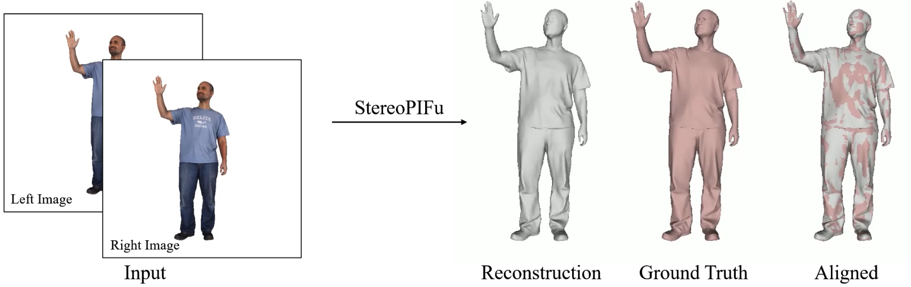

# StereoPIFu
### | [Project Page](https://crishy1995.github.io/StereoPIFuProject/) | [Paper](https://arxiv.org/pdf/2104.05289.pdf) | 

This repository contains a pytorch implementation of "[StereoPIFu: Depth Aware Clothed Human Digitization via Stereo Vision (CVPR 2021)](https://arxiv.org/abs/2104.05289)".


### Requirements
---
- Python 3
- Pytorch (<=1.4.0, some compatibility issues may occur in higher versions of pytorch) 
- tqdm
- opencv-python
- scikit-image
- openmesh

for building evaluation data
- [pybind11](https://github.com/pybind/pybind11),we recommend install with "pip install pybind11".
- gcc
- cmake

Run the following code to install all pip packages:
```bash
pip install -r requirements.txt 
```
<span id="Building_Evaluation"></span>
### Building Evaluation Data
---
#### Preliminary
Run the following script to compile & generate the relevant python module, which is capable of rendering left/right color/depth/mask images from textured/colored mesh.
```bash
cd GenEvalData
bash build.sh
cd ..
```
#### Usage

```bash
#demo, for textured mesh
python GenEvalData.py \
--tex_mesh_path="TempData/SampleData/rp_dennis_posed_004_100k.obj" \
--tex_img_path="TempData/SampleData/rp_dennis_posed_004_dif_2k.jpg" \
--save_dir="./TempData/TexMesh" \
--save_postfix="tex"
```

```bash
#demo, for colored mesh
python GenEvalData.py \
--color_mesh_path="TempData/SampleData/normalized_mesh_0089.off" \
--save_dir="./TempData/ColorMesh" \
--save_postfix="color"
```
These samples are from [renderpeople](https://renderpeople.com/free-3d-people/) and [BUFF](http://buff.is.tue.mpg.de/) dataset. 
Note: the bounding box of the mesh needs to be in a certain range. 

### Inference
---
#### Preliminary
- Run the following script to compile & generate deformable convolution from [AANet](https://github.com/haofeixu/aanet).
    ```bash
    cd AANetPlusFeature/deform_conv
    bash build.sh
    cd ../..
    ```
- Download the [trained model](https://mailustceducn-my.sharepoint.com/:u:/g/personal/hymath_mail_ustc_edu_cn/EQe1mmKZ7bxNojddIoHcGb8BKxVYhyWLJvKXdl6iZ__ESA?e=OMUjI9) and mv to the "Models" folder.
- Generate evalution data with aboved ["Building Evaluation Data"](#Building_Evaluation), or capture real data by [ZED Camera](https://www.stereolabs.com/zed/) (we test on ZED camera v1).
  - Note: rectifying left/right images is required before using ZED camera.
#### A Quick Demo
```bash
bash eval.sh
```
The reconsturction result will be saved to "Results" folder.
Note: At least 10GB GPU memory is recommended to run StereoPIFu model.

  <!-- citing -->
  <div class="container">
      <div class="row ">
          <div class="col-12">
              <h3>Citation</h3>
              <pre style="background-color: #e9eeef;padding: 1.25em 1.5em"><code>@inproceedings{yang2021stereopifu,
  author    = {Yang Hong and Juyong Zhang and Boyi Jiang and Yudong Guo and Ligang Liu and Hujun Bao},
  title     = {StereoPIFu: Depth Aware Clothed Human Digitization via Stereo Vision},
  booktitle = {{IEEE/CVF} Conference on Computer Vision and Pattern Recognition (CVPR)},
  year      = {2021}
}</code></pre>
              <hr>
          </div>
      </div>
  </div>